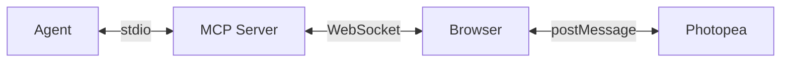

<p align="center">
  
</p>

<h1 align="center">Photopea MCP Server</h1>

<p align="center">
  Design posters, edit photos, and transform images directly from your terminal. Powered by <a href="https://www.photopea.com">Photopea</a> -- a free, browser-based alternative to Photoshop -- connected to your AI agent via <a href="https://modelcontextprotocol.io">MCP</a>.
</p>

<p align="center">
  <a href="https://github.com/bilal-arikan/photopea-mcp-server/blob/main/LICENSE"></a>
  <a href="https://nodejs.org"></a>
</p>

<p align="center">
  <em>A collaborative fork — original implementation by <a href="https://github.com/attalla1/photopea-mcp-server">attalla1</a>, extended together with <a href="https://github.com/bilal-arikan">bilal-arikan</a> (headless mode &amp; text-overlay support).</em>
</p>

## Demo

<p align="center">
  
</p>

<p align="center">
  <em>Prompt used in this demo: <a href="examples/album-cover-demo.md">examples/album-cover-demo.md</a></em>
</p>

## How It Works



Your agent sends editing commands through the MCP protocol. The server translates these into Photopea JavaScript API calls and executes them via a WebSocket bridge to the browser.

**Note:** A browser window will open automatically on the first tool call. This is expected -- Photopea runs entirely in the browser and the server needs it to perform image editing operations.

> Don't want a visible window? See [Headless Mode](#headless-mode-türkçe) below to run Photopea fully unattended in a headless Chromium.

## Headless Mode (Türkçe)

Varsayılan olarak ilk tool çağrısında görünür bir tarayıcı penceresi açılır. **Headless mod**, Photopea'yı görünür pencere olmadan, arka planda bir headless Chromium içinde çalıştırır — AI ajanının tamamen otomatik (unattended) kullanması için idealdir ve kullanıcının ana tarayıcısıyla çakışmayı önler.

### Kurulum

Headless mod **Playwright** kullanır (opsiyonel bağımlılık). Bir kez chromium indir:

```bash
npm install            # playwright opsiyonel bağımlılık olarak gelir
npm run headless:setup # = playwright install chromium
```

### Çalıştırma

Üç yoldan biriyle etkinleştirilir:

```bash
# 1) CLI flag
node dist/index.js --headless
npm run start:headless

# 2) Ortam değişkeni
PHOTOPEA_MCP_HEADLESS=1 node dist/index.js
```

MCP istemci config'inde (ör. Claude Code) `args` veya `env` üzerinden:

```json
{
  "command": "npx",
  "args": ["-y", "photopea-mcp-server", "--headless"]
}
```

### Ayarlar (ortam değişkenleri)

| Değişken | Açıklama |
|----------|----------|
| `PHOTOPEA_MCP_HEADLESS` | `1` / `true` → headless modu açar |
| `PHOTOPEA_MCP_BROWSER_CHANNEL` | Opsiyonel Playwright kanalı (`chrome`, `msedge`). Boşsa Playwright'ın paketli Chromium'u kullanılır |

### Notlar

- Playwright kurulu değilse headless mod başlatılırken açıklayıcı bir hata verir; **sistem-tarayıcı modu Playwright olmadan da çalışır.**
- Headless tarayıcı sunucu kapanınca otomatik kapatılır (sistem-tarayıcı modunda dış pencere yönetilmez).
- Doğrulama: `node scripts/smoke-headless.mjs` — headless'te belge oluştur → çiz → PNG export round-trip'ini test eder.

## Quick Start

```bash
claude mcp add -s user photopea -- npx -y photopea-mcp-server
```

Then start a new Claude Code session and ask it to edit images. The Photopea editor will open in your browser automatically on the first tool call.

## Installation

### Claude Code

**npx (recommended):**

```bash
claude mcp add -s user photopea -- npx -y photopea-mcp-server
```

**Global install:**

```bash
npm install -g photopea-mcp-server
claude mcp add -s user photopea -- photopea-mcp-server
```

### Claude Desktop

Add to your Claude Desktop config file (`~/Library/Application Support/Claude/claude_desktop_config.json` on macOS):

```json
{
  "mcpServers": {
    "photopea": {
      "command": "npx",
      "args": ["-y", "photopea-mcp-server"]
    }
  }
}
```

### Cursor

Add to Cursor MCP settings (`.cursor/mcp.json` in your project or `~/.cursor/mcp.json` globally):

```json
{
  "mcpServers": {
    "photopea": {
      "command": "npx",
      "args": ["-y", "photopea-mcp-server"]
    }
  }
}
```

### VS Code (Copilot)

Add to `.vscode/mcp.json` in your project:

```json
{
  "servers": {
    "photopea": {
      "command": "npx",
      "args": ["-y", "photopea-mcp-server"]
    }
  }
}
```

### Windsurf

Add to Windsurf MCP settings (`~/.windsurf/mcp.json`):

```json
{
  "mcpServers": {
    "photopea": {
      "command": "npx",
      "args": ["-y", "photopea-mcp-server"]
    }
  }
}
```

## Available Tools

### Document (5 tools)

| Tool | Description |
|------|-------------|
| `photopea_create_document` | Create a new document with specified dimensions and settings |
| `photopea_open_file` | Open an image from a URL or local file path |
| `photopea_get_document_info` | Get active document info (name, dimensions, resolution, color mode) |
| `photopea_resize_document` | Resize the active document (resamples content to fit) |
| `photopea_close_document` | Close the active document |

### Layer (11 tools)

| Tool | Description |
|------|-------------|
| `photopea_add_layer` | Add a new empty art layer |
| `photopea_add_fill_layer` | Add a solid color fill layer |
| `photopea_delete_layer` | Delete a layer by name or index |
| `photopea_select_layer` | Make a layer active by name or index |
| `photopea_set_layer_properties` | Set opacity, blend mode, visibility, name, or lock state |
| `photopea_move_layer` | Translate a layer by x/y offset |
| `photopea_duplicate_layer` | Duplicate a layer with optional new name |
| `photopea_reorder_layer` | Move a layer in the stack (above, below, top, bottom) |
| `photopea_group_layers` | Group named layers into a layer group |
| `photopea_ungroup_layers` | Ungroup a layer group |
| `photopea_get_layers` | Get the full layer tree as JSON |

### Text & Shape (3 tools)

| Tool | Description |
|------|-------------|
| `photopea_add_text` | Add a text layer at specified coordinates |
| `photopea_edit_text` | Edit content or style of an existing text layer |
| `photopea_add_shape` | Add a shape (rectangle or ellipse) |

### Image & Effects (9 tools)

| Tool | Description |
|------|-------------|
| `photopea_place_image` | Place an image from URL or local path |
| `photopea_apply_adjustment` | Apply brightness/contrast, hue/saturation, levels, or curves |
| `photopea_apply_filter` | Apply gaussian blur, sharpen, unsharp mask, noise, or motion blur |
| `photopea_transform_layer` | Scale, rotate, or flip a layer |
| `photopea_add_gradient` | Apply a linear gradient fill |
| `photopea_make_selection` | Create a rectangular, elliptical, or full selection |
| `photopea_modify_selection` | Expand, contract, feather, or invert a selection |
| `photopea_fill_selection` | Fill the current selection with a color |
| `photopea_clear_selection` | Deselect the current selection |

### Export & Utility (6 tools)

| Tool | Description |
|------|-------------|
| `photopea_export_image` | Export to PNG, JPG, WebP, PSD, or SVG |
| `photopea_load_font` | Load a custom font from a URL (TTF, OTF, WOFF2) |
| `photopea_list_fonts` | List available fonts, with optional search filter |
| `photopea_run_script` | Execute arbitrary Photopea JavaScript |
| `photopea_undo` | Undo one or more actions |
| `photopea_redo` | Redo one or more actions |

## Usage Examples

Once installed, ask your agent to perform image editing tasks:

**Create a poster:**
> "Create a 1920x1080 document with a dark blue background, add the title 'Hello World' in white 72px Arial, and export it as a PNG to ~/Desktop/poster.png"

**Edit a photo:**
> "Open ~/photos/portrait.jpg, increase the brightness by 30, apply a slight gaussian blur of 2px, and export as JPG to ~/Desktop/edited.jpg"

**Composite images:**
> "Create a 1200x630 document, place ~/assets/background.png as the base layer, then place ~/assets/logo.png and move it to the top-right corner"

**Batch adjustments:**
> "Open ~/photos/sunset.jpg, apply hue/saturation with +20 saturation, apply an unsharp mask with amount 50 and radius 2, then export as PNG"

## Development

```bash
git clone https://github.com/bilal-arikan/photopea-mcp-server.git
cd photopea-mcp-server
npm install
npm run build
```

### Commands

| Command | Description |
|---------|-------------|
| `npm run build` | Compile TypeScript to `dist/` |
| `npm run dev` | Watch mode with auto-reload |
| `npm test` | Run unit and integration tests |
| `npm start` | Start the server |

### Architecture

The server has four main components:

**MCP Server** (`src/server.ts`) -- Registers all 34 tools with the MCP SDK and connects via stdio transport.

**WebSocket Bridge** (`src/bridge/websocket-server.ts`) -- Manages the connection between the MCP server and the browser. Queues script execution requests and handles responses with timeouts.

**Script Builder** (`src/bridge/script-builder.ts`) -- Pure functions that translate tool parameters into Photopea JavaScript API calls. Each builder function generates a script string that Photopea can execute.

**Browser Frontend** (`src/frontend/index.html`) -- A single-page app that loads Photopea in an iframe, connects to the WebSocket bridge, and relays scripts to Photopea via `postMessage`. Returns results back through the WebSocket.

```
src/
  index.ts              # Entry point: HTTP server, browser launch, MCP startup
  server.ts             # MCP server initialization and tool registration
  bridge/
    websocket-server.ts # WebSocket bridge with request queue
    script-builder.ts   # Photopea JS code generators
    types.ts            # Protocol message types
  tools/
    document.ts         # Document operations (5 tools)
    layer.ts            # Layer operations (11 tools)
    text.ts             # Text and shape operations (3 tools)
    image.ts            # Image, adjustment, filter operations (9 tools)
    export.ts           # Export and utility operations (6 tools)
  utils/
    file-io.ts          # Local file read/write, URL fetching
    platform.ts         # Port discovery, browser launch
  frontend/
    index.html          # Browser UI with Photopea iframe
```

## Security

- The MCP server binds to `127.0.0.1` (localhost only) and is not accessible from the network.
- The `photopea_run_script` tool executes arbitrary JavaScript inside Photopea's sandboxed iframe. It is marked as destructive and requires user approval in MCP clients that support tool annotations.
- File operations (`open_file`, `export_image`, `place_image`) read and write files with the same permissions as the user running the server.

## Known Limitations

- Heavy scripts (e.g., gradients with many color steps) may cause the Photopea browser UI to become unresponsive. The operations still complete successfully in the background and exports will work as expected.
- Refreshing the browser page will discard all unsaved work. Export your documents before refreshing.
- Only one browser tab should be open at a time. Multiple tabs will conflict over the WebSocket connection.
- The `reorder_layer` tool may cause the Photopea UI to become unresponsive. To avoid this, create layers in the desired order rather than reordering after creation.

## Requirements

- Node.js >= 18
- A modern web browser (Chrome, Firefox, Edge, Safari)

## License

MIT
