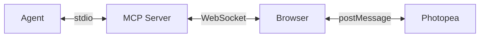

<p align="center">
  
</p>

<h1 align="center">Photopea MCP Server</h1>

<p align="center">
  Design posters, edit photos, and transform images directly from your terminal. Powered by <a href="https://www.photopea.com">Photopea</a> -- a free, browser-based alternative to Photoshop -- connected to your AI agent via <a href="https://modelcontextprotocol.io">MCP</a>.
</p>

<p align="center">
  <a href="https://github.com/bilal-arikan/photopea-mcp-server/blob/main/LICENSE"></a>
  <a href="https://nodejs.org"></a>
</p>

<p align="center">
  <em>A collaborative fork — original implementation by <a href="https://github.com/attalla1/photopea-mcp-server">attalla1</a>, extended together with <a href="https://github.com/bilal-arikan">bilal-arikan</a> (headless mode &amp; text-overlay support).</em>
</p>

## Demo

<p align="center">
  
</p>

<p align="center">
  <em>Prompt used in this demo: <a href="examples/album-cover-demo.md">examples/album-cover-demo.md</a></em>
</p>

## How It Works



Your agent sends editing commands through the MCP protocol. The server translates these into Photopea JavaScript API calls and executes them via a WebSocket bridge to the browser.

**Note:** A browser window will open automatically on the first tool call. This is expected -- Photopea runs entirely in the browser and the server needs it to perform image editing operations.

> Don't want a visible window? See [Headless Mode](#headless-mode) below to run Photopea fully unattended in a headless Chromium.

## Headless Mode

By default a visible browser window opens on the first tool call. **Headless mode** runs Photopea inside a background headless Chromium instead — ideal for fully unattended use by an AI agent, and it avoids conflicting with your main browser.

### Setup

Headless mode uses **Playwright** (an optional dependency). Install Chromium once:

```bash
npm install            # playwright comes in as an optional dependency
npm run headless:setup # = playwright install chromium
```

### Running

Enable it in any of three ways:

```bash
# 1) CLI flag
node dist/index.js --headless
npm run start:headless

# 2) Environment variable
PHOTOPEA_MCP_HEADLESS=1 node dist/index.js
```

In an MCP client config (e.g. Claude Code), via `args` or `env`:

```json
{
  "command": "npx",
  "args": ["-y", "photopea-mcp-server", "--headless"]
}
```

### Configuration (environment variables)

| Variable | Description |
|----------|-------------|
| `PHOTOPEA_MCP_HEADLESS` | `1` / `true` enables headless mode |
| `PHOTOPEA_MCP_BROWSER_CHANNEL` | Optional Playwright channel (`chrome`, `msedge`). When unset, Playwright's bundled Chromium is used |

### Notes

- If Playwright is not installed, headless startup fails with a clear error; **system-browser mode works without Playwright.**
- The headless browser is closed automatically when the server stops (an external system browser is not managed).
- Text layers are not rendered in headless Chromium — see [Headless-specific](#headless-specific) limitations for the overlay workaround.
- Verify with `node scripts/smoke-headless.mjs` — a headless create → draw → PNG-export round-trip check.

## Quick Start

```bash
claude mcp add -s user photopea -- npx -y photopea-mcp-server
```

Then start a new Claude Code session and ask it to edit images. The Photopea editor will open in your browser automatically on the first tool call.

## Installation

### Claude Code

**npx (recommended):**

```bash
claude mcp add -s user photopea -- npx -y photopea-mcp-server
```

**Global install:**

```bash
npm install -g photopea-mcp-server
claude mcp add -s user photopea -- photopea-mcp-server
```

### Claude Desktop

Add to your Claude Desktop config file (`~/Library/Application Support/Claude/claude_desktop_config.json` on macOS):

```json
{
  "mcpServers": {
    "photopea": {
      "command": "npx",
      "args": ["-y", "photopea-mcp-server"]
    }
  }
}
```

### Cursor

Add to Cursor MCP settings (`.cursor/mcp.json` in your project or `~/.cursor/mcp.json` globally):

```json
{
  "mcpServers": {
    "photopea": {
      "command": "npx",
      "args": ["-y", "photopea-mcp-server"]
    }
  }
}
```

### VS Code (Copilot)

Add to `.vscode/mcp.json` in your project:

```json
{
  "servers": {
    "photopea": {
      "command": "npx",
      "args": ["-y", "photopea-mcp-server"]
    }
  }
}
```

### Windsurf

Add to Windsurf MCP settings (`~/.windsurf/mcp.json`):

```json
{
  "mcpServers": {
    "photopea": {
      "command": "npx",
      "args": ["-y", "photopea-mcp-server"]
    }
  }
}
```

## Available Tools

### Document (5 tools)

| Tool | Description |
|------|-------------|
| `photopea_create_document` | Create a new document with specified dimensions and settings |
| `photopea_open_file` | Open an image from a URL or local file path |
| `photopea_get_document_info` | Get active document info (name, dimensions, resolution, color mode) |
| `photopea_resize_document` | Resize the active document (resamples content to fit) |
| `photopea_close_document` | Close the active document |

### Layer (11 tools)

| Tool | Description |
|------|-------------|
| `photopea_add_layer` | Add a new empty art layer |
| `photopea_add_fill_layer` | Add a solid color fill layer |
| `photopea_delete_layer` | Delete a layer by name or index |
| `photopea_select_layer` | Make a layer active by name or index |
| `photopea_set_layer_properties` | Set opacity, blend mode, visibility, name, or lock state |
| `photopea_move_layer` | Translate a layer by x/y offset |
| `photopea_duplicate_layer` | Duplicate a layer with optional new name |
| `photopea_reorder_layer` | Move a layer in the stack (above, below, top, bottom) |
| `photopea_group_layers` | Group named layers into a layer group |
| `photopea_ungroup_layers` | Ungroup a layer group |
| `photopea_get_layers` | Get the full layer tree as JSON |

### Text & Shape (3 tools)

| Tool | Description |
|------|-------------|
| `photopea_add_text` | Add a text layer at specified coordinates |
| `photopea_edit_text` | Edit content or style of an existing text layer |
| `photopea_add_shape` | Add a shape (rectangle or ellipse) |

### Image & Effects (9 tools)

| Tool | Description |
|------|-------------|
| `photopea_place_image` | Place an image from URL or local path |
| `photopea_apply_adjustment` | Apply brightness/contrast, hue/saturation, levels, or curves |
| `photopea_apply_filter` | Apply gaussian blur, sharpen, unsharp mask, noise, or motion blur |
| `photopea_transform_layer` | Scale, rotate, or flip a layer |
| `photopea_add_gradient` | Apply a linear gradient fill |
| `photopea_make_selection` | Create a rectangular, elliptical, or full selection |
| `photopea_modify_selection` | Expand, contract, feather, or invert a selection |
| `photopea_fill_selection` | Fill the current selection with a color |
| `photopea_clear_selection` | Deselect the current selection |

### Export & Utility (6 tools)

| Tool | Description |
|------|-------------|
| `photopea_export_image` | Export to PNG, JPG, WebP, PSD, or SVG — to disk (`outputPath`) and/or returned **inline** as base64 so the AI can see it |
| `photopea_load_font` | Load a custom font from a URL (TTF, OTF, WOFF2) |
| `photopea_list_fonts` | List available fonts, with optional search filter |
| `photopea_run_script` | Execute arbitrary Photopea JavaScript |
| `photopea_undo` | Undo one or more actions |
| `photopea_redo` | Redo one or more actions |

### Preview & AI (3 tools)

| Tool | Description |
|------|-------------|
| `photopea_get_canvas_preview` | Render a small, downscaled, **non-destructive** snapshot of the active document and return it inline so the AI can *see* the canvas |
| `photopea_remove_background` | AI background removal (Dezgo) — opens the transparent cutout as a new document. **Requires an API key.** |
| `photopea_generative_fill` | AI generative fill / inpainting of a rectangular region from a text prompt (Dezgo). **Requires an API key.** |

#### AI feature API key

The AI tools call **Dezgo** (the same backend Photopea uses for "Remove BG" / "Magic Replace") and need **your own API key**, supplied via an environment variable:

| Variable | Used by | Provider |
|----------|---------|----------|
| `PHOTOPEA_MCP_DEZGO_KEY` (or `DEZGO_API_KEY`) | `remove_background`, `generative_fill` | [Dezgo](https://dev.dezgo.com/) |

Without a key the AI tools return a clear error; all other tools work unchanged.

## Usage Examples

Once installed, ask your agent to perform image editing tasks:

**Create a poster:**
> "Create a 1920x1080 document with a dark blue background, add the title 'Hello World' in white 72px Arial, and export it as a PNG to ~/Desktop/poster.png"

**Edit a photo:**
> "Open ~/photos/portrait.jpg, increase the brightness by 30, apply a slight gaussian blur of 2px, and export as JPG to ~/Desktop/edited.jpg"

**Composite images:**
> "Create a 1200x630 document, place ~/assets/background.png as the base layer, then place ~/assets/logo.png and move it to the top-right corner"

**Batch adjustments:**
> "Open ~/photos/sunset.jpg, apply hue/saturation with +20 saturation, apply an unsharp mask with amount 50 and radius 2, then export as PNG"

## Development

```bash
git clone https://github.com/bilal-arikan/photopea-mcp-server.git
cd photopea-mcp-server
npm install
npm run build
```

### Commands

| Command | Description |
|---------|-------------|
| `npm run build` | Compile TypeScript to `dist/` |
| `npm run dev` | Watch mode with auto-reload |
| `npm run dev:headless` | Watch mode in headless Chromium |
| `npm test` | Run unit and integration tests |
| `npm run test:e2e` | Run end-to-end tests |
| `npm start` | Start the server (system browser) |
| `npm run start:headless` | Start the server in headless mode |
| `npm run headless:setup` | Download Playwright Chromium (one-time) |

### Architecture

The server has four main components:

**MCP Server** (`src/server.ts`) -- Registers all 37 tools with the MCP SDK and connects via stdio transport.

**WebSocket Bridge** (`src/bridge/websocket-server.ts`) -- Manages the connection between the MCP server and the browser. Queues script execution requests and handles responses with timeouts.

**Script Builder** (`src/bridge/script-builder.ts`) -- Pure functions that translate tool parameters into Photopea JavaScript API calls. Each builder function generates a script string that Photopea can execute.

**Browser Frontend** (`src/frontend/index.html`) -- A single-page app that loads Photopea in an iframe, connects to the WebSocket bridge, and relays scripts to Photopea via `postMessage`. Returns results back through the WebSocket. Script completion is detected via a unique `echoToOE` sentinel (not Photopea's spurious document-open `"done"`), so combined create+export scripts return reliably.

**Browser Launcher** (`src/browser/`, `src/config.ts`) -- Pluggable launch strategy injected into the bridge. `system-launcher.ts` opens the user's default browser (default); `headless-launcher.ts` drives a headless Chromium via Playwright. `config.ts` resolves the strategy from `--headless` / `PHOTOPEA_MCP_HEADLESS` / `PHOTOPEA_MCP_BROWSER_CHANNEL`.

```
src/
  index.ts              # Entry point: HTTP server, browser launch, MCP startup
  server.ts             # MCP server initialization and tool registration
  config.ts             # Launch config (headless flag / env resolution)
  bridge/
    websocket-server.ts # WebSocket bridge with request queue + injectable launcher
    script-builder.ts   # Photopea JS code generators
    types.ts            # Protocol message types
  browser/
    types.ts            # BrowserHandle / BrowserLauncher contracts
    launcher.ts         # Resolves system vs headless launcher
    system-launcher.ts  # Opens the default system browser
    headless-launcher.ts# Headless Chromium via Playwright (optional dep)
  tools/
    document.ts         # Document operations (5 tools)
    layer.ts            # Layer operations (11 tools)
    text.ts             # Text and shape operations (3 tools)
    image.ts            # Image, adjustment, filter operations (9 tools)
    export.ts           # Export and utility operations (6 tools)
    preview.ts          # Non-destructive inline canvas preview (1 tool)
    ai.ts               # AI background removal + generative fill (2 tools)
  ai/                   # AI provider abstraction (Dezgo / remove.bg)
    config.ts           # Resolves API keys from the environment
    providers.ts        # Pure request builders + fetch executor
    index.ts            # removeBackground / generativeInpaint orchestration
  utils/
    file-io.ts          # Local file read/write, URL fetching
    mcp-content.ts      # Inline image/text MCP content helpers
    platform.ts         # Port discovery, browser launch
  frontend/
    index.html          # Browser UI with Photopea iframe
scripts/                # Dev/demo harnesses (not shipped to npm)
  smoke-headless.mjs    # Headless create/draw/export round-trip check
  designer-scenarios.mjs# 10 designer use-cases on real images
  harder-scenarios.mjs  # 10 advanced composites (collage, duotone, vignette…)
  make_text_overlay.py  # Pillow text overlay (headless text workaround)
  make_overlay.py       # Pillow multi-primitive overlay (ring/gradient/tiled…)
  make_circle.py        # Pillow circular crop + ring
```

## Security

- The MCP server binds to `127.0.0.1` (localhost only) and is not accessible from the network.
- The `photopea_run_script` tool executes arbitrary JavaScript inside Photopea's sandboxed iframe. It is marked as destructive and requires user approval in MCP clients that support tool annotations.
- File operations (`open_file`, `export_image`, `place_image`) read and write files with the same permissions as the user running the server.

## Known Limitations

- Heavy scripts (e.g., gradients with many color steps) may cause the Photopea browser UI to become unresponsive. The operations still complete successfully in the background and exports will work as expected.
- Refreshing the browser page will discard all unsaved work. Export your documents before refreshing.
- Only one browser tab should be open at a time. Multiple tabs will conflict over the WebSocket connection. (Headless mode sidesteps this — it runs its own dedicated Chromium.)
- The `reorder_layer` tool may cause the Photopea UI to become unresponsive. To avoid this, create layers in the desired order rather than reordering after creation.

### Headless-specific

- **Text layers do not render in headless Chromium.** A text layer is created but never lays out (its bounds stay `[0,0,0,0]`) and is absent from the export, even though the font list loads. Add text by rasterizing it to a transparent PNG and compositing it (see `scripts/make_text_overlay.py` + the overlay-composite pattern in `scripts/designer-scenarios.mjs`), or run text-heavy work in the visible system-browser mode.
- Creating a blank document from scratch requires a resolution argument; the `create_document` tool always passes one, so this only affects raw `run_script` calls (`app.documents.add(w, h, 72)`).

## Requirements

- Node.js >= 18
- A modern web browser (Chrome, Firefox, Edge, Safari) for system-browser mode
- **Headless mode:** [Playwright](https://playwright.dev) + Chromium (`npm run headless:setup`)
- **Overlay helper scripts** (`scripts/*.py`): Python 3 + [Pillow](https://python-pillow.org) (`pip install pillow`)

## License

MIT
